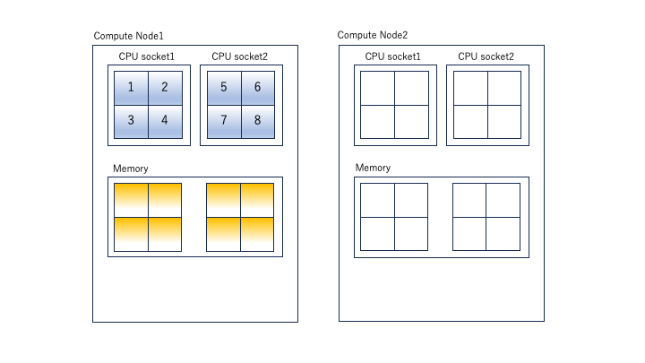
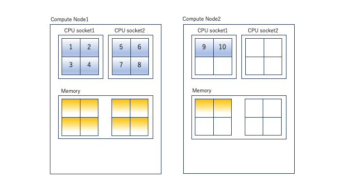
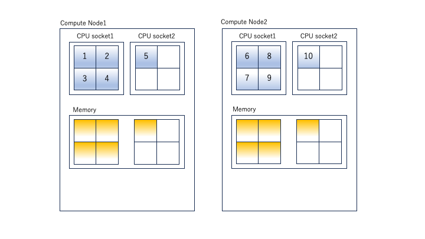

 
 CPU コアを複数同時に使用し、長時間実行するプログラムを少数実行する場合は、並列ジョブ(parallel job)として実行してください（多数実行する場合は並列ジョブのアレイジョブを使ってください。）。投入コマンドはsbatchコマンドを利用します。

 SlurmにはAGEでのPE(Parallel Environment)に対応する機能はありません。ほぼ同等のコアのわり付け方をすると考えられるオプションの指定の仕方についてご紹介します。
 
 参考情報

 - [Support for MultiCore/Multi-Thread Architecture(開発元の詳細ドキュメント)](https://slurm.schedmd.com/mc_support.html)
 - [CPU Management User and Administrator Guide](https://slurm.schedmd.com/cpu_management.html)


## パラレルジョブの種類（概要）

AGEのPEで用意されている環境に沿って、Slurmで、それに対応するコアの割り付け方をほぼ実現する為のSlurmでのオプション群を示します。

|AGEで用意していたPE環境名|PE環境の意味| 同様の資源確保をするために指定するSlurmオプション群(例)（オプション詳細の意味は後述）|
|-----------------|----------------------------|---------|
|def_slot  |同一計算ノード上にNTASK個のCPUコアを確保する(NTASKが計算ノード上のCPUコアを超えている場合はジョブは開始されない|-N 1-1 --n NTASK|
|mpi |複数の計算ノードに渡ってNTASK個のCPUを用意する。その際に計算ノードはより分散して計算ノードを使用するようにしてラウンドロビンでタスクを割り当てる| 遺伝研スパコンのSlurm運用ではユーザが--ntasks-per-nodeを明示的に指定してノードへの分散を指示することを推奨（pe_nと同じ)|
|mpi-fillup  |複数の計算ノードにわたって NTASK 個の CPU コアを確保する。その際に計算ノードの台数がなるべく少なくなるようコアが確保される。|[-N NODES] -n NTASK|
|pe_n  |複数の計算ノードにわたって NTASK_1個の CPU コアを確保する。その際に計算ノード上にNTASK_2個のCPUコアを割り当てる|[-N NODES] -n NTASK_1 --ntasks-per-node=NTASK_2|

AGEのPEの場合と異なり、上記のNTASK数で範囲指定はできません。上記のNODESについては範囲指定が可能で、-N MINNODES-MAXNODESと最小ノード数と最大ノード数を範囲指定することが可能です。

Slurmの場合は、-Nで指定するノード数と --ntasks-per-nodeで指定するノード単位で割り当てるタスク数を調整することで並列ジョブを実行することが一般的です。この際に、ノード数とノード単位のタスク数の積が全体のタスク数（並列数）になる点に注意してください。

### 並列ジョブに対して、メモリ要求量を指定する際の注意事項

並列ジョブに対して--mem(1ノードあたりでそのジョブに割り当てるメモリ量)、--mem-per-cpu(1CPUコアあたりでそのジョブに割り当てるメモリ量)を指定する場合、指定したノード数、またはCPUコア数と指定したメモリ量が掛け合わされた容量のメモリをシステムに要求してジョブが投入されますので、その点に留意してください。


## パラレルジョブの種類（詳細）

### CPUとメモリ確保の様子

sbatch、srunコマンド実行時にオプションで明示的にメモリ量を指定しない場合、システム側の設定により、CPUコアあたり8GBのメモリが割り当てられます。（計算機の種類、キューの種類によって異なります。）

例えば、下記のように指定した場合、並列ジョブが使用するメモリ総量として 計算ノード1台上に16×8=128GB を指定したことになります。 その点について注意した上で指定する要求メモリ量を決定してください。

```
-N 1-1 -n 16 --mem-per-cpu 8G 
```


### 並列ジョブ(1)（def_slotに対応) 　同一の計算ノードに指定したコア数を充填して確保する実行方法

一台の計算ノード上でNTASK個のコアを取得してジョブを投入する方法は以下のようになります。この際、--mem-per-cpuオプションを指定して、1CPUコアあたりのメモリ量を指定すると、CPUコア数とタスク数の積のメモリ量が計算ノード上で確保されるのでご注意ください。

```
#!/bin/bash
#SBATCH -N 1-1  #ジョブに割り当てるノード数(=1)を指定
#SBATCH -n 8　　# ジョブ全体でのタスク数を指定
#SBATCH -t 0-00:10:00
#SBATCH --mem-per-cpu=10G
#SABATCH -J example-1
```



本ページの記述はあくまで例で、説明を簡略にするために1CPUのコア数を4にして説明しています。実際の計算ノードのコア数はまた異なりますので、実際に使用する計算ノードのハードウェア仕様に合わせて調整してください。ノードに搭載されているコア数を超えて上記の指定でジョブ投入はできません。またジョブの投入状況によりコアの割り当て方も例の様にいかない場合があります。

### 並列ジョブ(3)(mpi-fillupに対応) 複数の計算ノードを割り当て、なるべく同一の計算ノードにタスクを充填してコア数を確保する方法（利用する計算ノード数は極力少数になる方法）
個人ゲノム解析区画のSlurmは、極力計算ノード上に充填してタスクを割り当てていくように設定されています。

```
#!/bin/bash
#SBATCH -N 2
#SBATCH -n 10
#SBATCH -t 0-00:10:00
#SBATCH --mem-per-cpu=10G
#SABATCH -J an_example3
```



Slurmのデフォルト動作として、タスクを計算ノードに充填しながら割り当てていきます。

### 並列ジョブ(４)（pe_nに対応) 複数の計算ノードを割り当て、計算ノード１台あたり確保するCPUコア数を指定してジョブを実行する方法

```
#!/bin/bash
#SBATCH -N 2
#SBATCH -n 10
#SBATCH -t 0-00:10:00
#SBATCH --ntasks-per-node=5
#SBATCH --mem-per-cpu=10G
#SABATCH -J an_example
```



### MPIプログラムを実行する場合

遺伝研スパコンでは、OpenMPIをMPI処理系の実装としてインストールしています。
以下のような形で、OpenMPIの環境定義を行うモジュールファイルを読み込んで環境を設定し、OpenMPIのmpirunコマンドを利用してMPIプログラムの実行モジュールを起動してください。mpirunの-npオプションには、SLURM環境変数のSLURM_NTASKを以下のように渡してください。

```
#!/bin/bash
#SBATCH -p
#SBATCH --job-name mpi-test
#SBATCH --nodes=4
#SBATCH --ntasks=8
#SBATCH -o %x.%J.out

module load xxxxx
mpirun -np ${SLURM_NTASKS} mpi_test

```

上記のように記述すれば、sbatch側でSlurmに必要計算資源を要求してmpirunでプロセスを起動していくという動作になります。


### OpenMPで記述されたプログラムを実行する場合
遺伝研スパコンでインストールしている、Intel Compiler、NVIDIA HPC CompilerはOpenMPをサポートしています。OpenMPのバイナリモジュールを実行する際には、ランタイム変数としてOMP_NUM_THREADSを環境変数として指定してスレッド並列数を指定する必要がありますので、以下のような記述でOMP_NUM_THREADSを設定してプログラムを実行してください。

```
!#/bin/bash
#SBATCH -p パーティション名
#SBATCH -n 1               #ジョブで起動するプロセス数を指定。この場合１
#SBATCH -c 20　　　　　　　 # ジョブで使用するCPUコア数を指定する。(ノード内で利用できるCPUコア数を指定)
export OMP_NUM_THREADS=${SLURM_CPUS_PER_TASK}
./a.out
exit $?

```
上記でOMP_NUM_THREADSという環境変数を指定しているのは、a.outがOpenMPを利用して記述されたプログラムである場合、何Coreを利用してスレッド並列でプログラムを実行するか。を指定しています。

### 並列ジョブで利用するSlurmの環境変数

ジョブの実行時に、以下の環境変数が、起動されたジョブの環境変数に渡されています。これを利用して内部の並列動作を上の例の様に指示します。利用可能な環境変数の詳細については、オンラインマニュアルを参照してください。

[オンラインマニュアルの環境変数の記述](https://slurm.schedmd.com/srun.html#SECTION_OUTPUT-ENVIRONMENT-VARIABLES)

|Slurm環境変数名|変数の説明|
|--------------|---------|
|SLURM_NTASKS | -n で指定したタスク数|
|SLURM_CPUS_PER_TASK|-c　で指定したCPUコア数|
|SLURM_JOB_ID | ジョブID |
|SLURM_MEM_PER_CPU | --mem-per-cpu で設定したメモリ量 |

### 並列ジョブでどの計算ノードが確保されたかを知る方法
squeueでジョブが投入されたことを確認します。表示された項目の中でNODESは確保されたノード数、NODELISTがノード名のリストを示します。

```
$ squeue
 JOBID PARTITION     NAME     USER ST       TIME  NODES NODELIST(REASON)
  21     debug  test.sh ymunakat  R       0:02      2 swx630-[1-2]

```


### Slurmでのマルチコア・マルチスレッド動作を指定する場合に必要な用語定義・説明

参考にSlurmでマルチスレッドプログラム、MPI並列プログラムをシステムに投入する場合に確認が必要な用語について説明します。

[出典ページ Support for Multi-Core/Multi-Thread Architecture](https://slurm.schedmd.com/mc_support.html)

|用語| 定義・説明|
|----------|-------|
|タスク |スレッド動作の説明時にはジョブと同義に使われますが、アレイジョブの説明時にはジョブから起動される子ジョブをタスクと呼ぶ場合があります。また１つのタスクが複数コアを要求する場合がありますが、デフォルト動作ではコア数=タスク数と考えてください。|
| Socket | 物理的なCPUを指していると考えてください。遺伝研スパコンのThin計算ノードでは、Socket数は２になります。|
|CPU | オプション指定でのSlurm用語の中では、CPUは物理CPUを表すのではなくコアと考えてください。 |
| コア |オプション指定でのSlurm用語の中では、CPU(数)=コア(数)と考えてください。 |
|スレッド |HyperThreading動作が無効な場合は数値としてはスレッド=コアとなります。遺伝研スパコンではスレッド数=コア数で考えてください。|


### 並列動作、マルチスレッド動作を指定する際の各オプションの説明

[出典ページ Support for Multi-Core/Multi-Thread Architecture](https://slurm.schedmd.com/mc_support.html)

#### 高レベルでタスクの分散を決定する場合に指定するオプション群

|オプション| 説明 |
|--------|-----|
|--sockets-per-node=S | ジョブに割り当てる１ノード内のソケット数（最小値）|
|--cores-per-socket=C |ジョブに割り当てる１つのソケット内のコア数（最小値）|
|--threads-per-core=T |ジョブに割り当てる、１つのコア内のスレッド数（最小値）|
|-B S[:C[:T]] | 上記３つのオプションの省略記法 |


#### タスクの分散のさせ方を指定するオプション群

|オプション|説明|
|--------|----|
|-m/--distribution| タスクの分散のさせ方をキーワードで指定。arbitary または block または cyclic または plane=x または [block または cyclic]:[block または cyclic または fcyclic]。ノードまたぎの分散のさせ方を指定する仕方と、ノード内のソケットまたぎの分散のさせ方を指定する仕方がある。|

[plane distributionの説明(開発元)](https://slurm.schedmd.com/dist_plane.html)


#### 計算ノードへのタスクの割り付け方法のキーワード種別について

|割り付け方法の種類| 説明 |
|-------------|-----|
|block |ジョブに割り当てられたノードに連番のタスクが極力充填（ノードが共有）されるようにタスクを割り付けていきます。|
|cyclic |ジョブに割り当てられたノードに連番のタスクが極力分散されるようにタスクを割り付けていきます|
|plane=size|sizeに指定されたブロックサイズのブロックでタスクが分散される。|
|arbitary|SLURM_HOSTFILEに設定された順序で割り付けを行う。他の方法に比べて複雑なのでここでは説明省略します。詳細は参考資料をご参照ください。|

#### ソケット上でのコア(タスク)の割り付け方法のキーワード種別について

|割り付け方法の種類| 説明 |
|-------------|-----|
|block |連続したタスクを極力一つのソケットに充填するようにコアを割り当てていきます。|
|cyclic |連続したタスクを同一ノード上の別のソケットに分散されるようにコアを割り当てていきます。一つのタスクで複数のコアが要求される場合は、同一ソケット上のコアを割り当てるようにします。|
|fcyclic|sizeに指定されたブロックサイズのブロックでタスクが分散される。一つのタスクで複数のコアが要求される場合も、ソケット跨りでコアを割り当てるようにします|


#### メモリを消費資源として指定するオプション群

|オプション|説明|
|---------|---|
|--mem=mem |ジョブ内で1ノード単位で要求する実メモリ量を指定。デフォルト単位はM、K、Gを指定可能|
|--mem-per-cpu=mem|ジョブ内で1CPU単位で要求するメモリ量を指定。デフォルト単位はM,K。K,Gを指定可能|

#### タスク起動のさせ方を制御、指定するオプション群

|オプション|意味|
|---------|----|
|--cpus-per-task=CPUs |タスク単位で必要になるCPU数を指定|
|--ntasks-per-node=ntasks |１つのノードに割り当てるジョブ内のタスク数|
|--ntasks-per-core=ntasks |１つのコアに割り当てるジョブ内のタスク数|
|--ntasks-per-socket=ntasks |1つのソケットに割り当てるジョブ内のタスク数|
|--overcommit|CPU単位に1つ以上のタスクの起動を許容する|

#### アプリケーションの性質を指定して割り付け方を指定するオプション群

|オプション|説明|
|--------|----|
|--hint=compute_bound| それぞれのソケット内のコアをすべて割り付ける（計算インテンシブなジョブ用のオプション）|
|--hint=memory_bound|それぞれのソケット内の一つのコアだけを割り付ける（メモリ帯域幅が必要なジョブ用のオプション）|
|--hint=[no]multithread|1つのコア内でのマルチスレッド動作を許容してタスクを割り付ける[割り付けない]|

#### システムで利用する計算資源の確保を指定するオプション群（システム利用分をアプリケーションへの割り当てから除外する考え方）

|オプション|説明|
|---------|---|
|--core-spec=cores|システムの利用の為に残すコア数|
|--thred-spec=threads|システムの利用の為に残すスレッド数|


