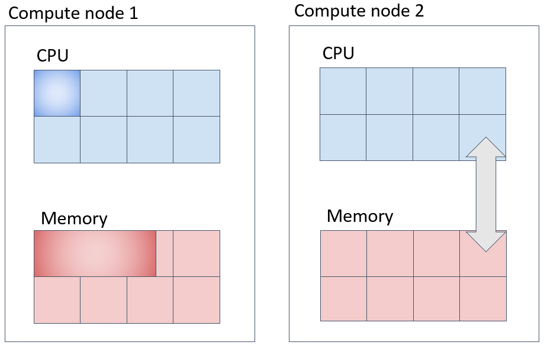
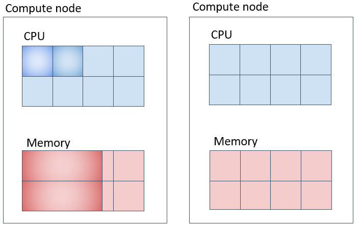
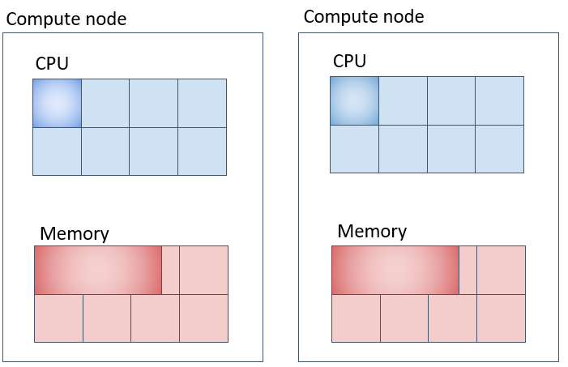

 CPU コアを複数同時に使用し、長時間実行するプログラムを少数実行する場合は、並列ジョブ(parallel job)として実行してください（多数実行する場合は並列ジョブのアレイジョブを使ってください。）。投入コマンドはsbatchコマンドを利用します。

 SlurmにはAGEでのPE(Parallel Environment)に対応する機能はありません。ほぼ同等のコアのわり付け方をすると考えられるオプションの指定の仕方についてご紹介します。
 
 参考情報

 - [Support for MultiCore/Multi-Thread Architecture(開発元の詳細ドキュメント)](https://slurm.schedmd.com/mc_support.html)
 - [CPU Management User and Administrator Guide](https://slurm.schedmd.com/cpu_management.html)


## パラレルジョブの種類（概要）

AGEのPEで用意されている環境に沿って、Slurmで、それに対応するコアの割り付け方をほぼ実現する為のSlurmでのオプション群を示します。

|AGEで用意していたPE環境名|PE環境の意味| 同様の資源確保をするために指定するSlurmオプション群(例)|
|-----------------|----------------------------|---------|
|def_slot  |同一計算ノード上にNTASK個のCPUコアを確保する(NTASKが計算ノード上のCPUコアを超えている場合はジョブは開始されない|-N 1-1 --n NTASK|
|mpi |複数の計算ノードに渡ってNTASK個のCPUコアを用意する。その際に計算ノードはより分散して計算ノードを使用するようにしてラウンドロビンでタスクを割り当てる| -N NODES -m cyclic --exclusive |
|mpi-fillup  |複数の計算ノードにわたって NTASK 個の CPU コアを確保する。その際に計算ノードの台数がなるべく少なくなるようコアが確保される。|[-N NODES] -n NTASK|
|pe_n  |複数の計算ノードにわたって NTASK_1個の CPU コアを確保する。その際に計算ノード上にNTASK_2個のCPUコアを割り当てる|[-N NODES] -n NTASK_1 --ntasks-per-node=NTASK_2|

AGEのPEの場合と異なり、上記のNTASK数で範囲指定はできません。上記のNODESについては範囲指定が可能で、-N MINNODES-MAXNODESと最小ノード数と最大ノード数を範囲指定することが可能です。

Slurmの場合は、-Nで指定するノード数と --ntasks-per-nodeで指定するノード単位で割り当てるタスク数を調整することで並列ジョブを実行することが一般的です。この際に、ノード数とノード単位のタスク数の積が全体のタスク数（並列数）になる点に注意してください。

### 並列ジョブに対して、メモリ要求量を指定する際の注意事項

並列ジョブに対して--mem(1ノードあたりでそのジョブに割り当てるメモリ量)、--mem-per-cpu(1CPUコアあたりでそのジョブに割り当てるメモリ量)を指定する場合、指定したノード数、またはCPUコア数と指定したメモリ量が掛け合わされた容量のメモリをシステムに要求してジョブが投入されますので、その点に留意してください。


## パラレルジョブの種類（詳細）

### CPUとメモリ確保の様子

sbatch、srunコマンド実行時にオプションで明示的にメモリ量を指定しない場合、システム側の設定により、CPUコアあたり8GBのメモリが割り当てられます。（計算機の種類、キューの種類によって異なります。）

例えば、下記のように指定した場合、並列ジョブが使用するメモリ総量として 計算ノード1台上に16×8=128GB を指定したことになります。 その点について注意した上で指定する要求メモリ量を決定してください。

```
-N 1-1 -n 16 --mem-per-cpu 8G 
```


### 並列ジョブ(1)（def_slotに対応) 　同一の計算ノードに指定したコア数を充填して確保する実行方法

一台の計算ノード上でNTASK個のコアを取得してジョブを投入する方法は以下のようになります。この際、--mem-per-cpuオプションを指定して、1CPUコアあたりのメモリ量を指定すると、CPUコア数とタスク数の積のメモリ量が計算ノード上で確保されるのでご注意ください。

import Marker from '@site/src/components/Marker';

```
#!/bin/bash
#SBATCH -N 1-1 
#SBATCH -n 2　
#SBATCH --mem-per-cpu=20G
#SBATCH -t 0-00:10:00
#SABATCH -J an_example

make -j 2
```



上図の例では、メモリは1タスクあたり20GB、20GB×2コア=40GBが一台の計算機の中に確保されます。

### 並列ジョブ(2)（mpiに対応) 　なるべく別の計算ノード上に指定したコア数を確保する。
```
#!/bin/bash
#SBATCH -N 2 
#SBATCH -n 8　　
#SBATCH -m cyclic
#SBATCH --exclusive
#SBATCH --mem-per-cpu=10G
#SBATCH -t 0-00:10:00
#SABATCH -J an_example

your_program
```


上記の場合、-Nが確保するノード数、-n がジョブ全体のタスク数、-m　がタスクの割り当て方を指定していて、cyclicと指定するとなるべくノード間にラウンドロビンでタスクを割り当てようとします。

### 並列ジョブ(3)(mpi-fillupに対応) なるべく同一の計算ノード上に詰めて指定したコア数を確保する。

個人ゲノム解析区画のSlurmは、極力計算ノード上に充填してタスクを割り当てていくように設定されています。

```
#!/bin/bash
#SBATCH -N 2
#SBATCH -n 4
#SBATCH -t 0-00:10:00
#SBATCH --mem-per-cpu=20G
#SABATCH -J an_example

your_program
```



Slurmのデフォルト動作として、タスクを計算ノードに充填しながら割り当てていきます。入りきらない場合は、別の計算機にリソースを確保しようとします。上図の例だとメモリは1CPUコア当たり20GB、2台の計算機のうち、どちらか一方の計算機に 3コア×20GB = 60GB、もう1台に1コア × 20GB = 20GB、合計 20GB × 4コア = 80GB 確保されます。

### 並列ジョブ(４)（pe_nに対応) 各計算ノード上に指定したコア数を確保して複数計算ノードを使用する方法

```
#!/bin/bash
#SBATCH -N 2
#SBATCH -n 8
#SBATCH -t 0-00:10:00
#SBATCH --ntasks-per-node=4
#SBATCH --mem-per-cpu=8G
#SABATCH -J an_example
```


メモリの取られ方は上図の通りだと１CPUコア当たり8GB、各計算機に 4コアx8GB = 32GB ずつ、合計 32GB x 2台 = 64GB 取られます。

### MPIプログラムを実行する場合

遺伝研スパコンでは、OpenMPIをMPI処理系の実装としてインストールしています。
以下のような形で、OpenMPIの環境定義を行うモジュールファイルを読み込んで環境を設定し、OpenMPIのmpirunコマンドを利用してMPIプログラムの実行モジュールを起動してください。mpirunの-npオプションには、SLURM環境変数のSLURM_NTASKを以下のように渡してください。

```
#!/bin/bash
#SBATCH -p
#SBATCH --job-name mpi-test
#SBATCH --nodes=4
#SBATCH --ntasks=8
#SBATCH -o %x.%J.out

module load xxxxx
mpirun -np ${SLURM_NTASKS} mpi_test

```

上記のように記述すれば、sbatch側でSlurmに必要計算資源を要求してmpirunでプロセスを起動していくという動作になります。


### OpenMPで記述されたプログラムを実行する場合
遺伝研スパコンでインストールしている、Intel Compiler、NVIDIA HPC CompilerはOpenMPをサポートしています。OpenMPのバイナリモジュールを実行する際には、ランタイム変数としてOMP_NUM_THREADSを環境変数として指定してスレッド並列数を指定する必要がありますので、以下のような記述でOMP_NUM_THREADSを設定してプログラムを実行してください。

```
!#/bin/bash
#SBATCH -p パーティション名
#SBATCH -n 1               #ジョブで起動するプロセス数を指定。この場合１
#SBATCH -c 20　　　　　　　 # ジョブで使用するCPUコア数を指定する。(ノード内で利用できるCPUコア数を指定)
export OMP_NUM_THREADS=${SLURM_CPUS_PER_TASK}
./a.out
exit $?

```
上記でOMP_NUM_THREADSという環境変数を指定しているのは、a.outがOpenMPを利用して記述されたプログラムである場合、何Coreを利用してスレッド並列でプログラムを実行するか。を指定しています。

### 並列ジョブで利用するSlurmの環境変数

ジョブの実行時に、以下の環境変数が、起動されたジョブの環境変数に渡されています。これを利用して内部の並列動作を上の例の様に指示します。利用可能な環境変数の詳細については、オンラインマニュアルを参照してください。

[オンラインマニュアルの環境変数の記述](https://slurm.schedmd.com/srun.html#SECTION_OUTPUT-ENVIRONMENT-VARIABLES)

|Slurm環境変数名|変数の説明|
|--------------|---------|
|SLURM_NTASKS | -n で指定したタスク数|
|SLURM_CPUS_PER_TASK|-c　で指定したCPUコア数|
|SLURM_JOB_ID | ジョブID |
|SLURM_MEM_PER_CPU | --mem-per-cpu で設定したメモリ量 |

### 並列ジョブでどの計算ノードが確保されたかを知る方法
squeueでジョブが投入されたことを確認します。表示された項目の中でNODESは確保されたノード数、NODELISTがノード名のリストを示します。

```
$ squeue
 JOBID PARTITION     NAME     USER ST       TIME  NODES NODELIST(REASON)
  21     debug  test.sh ymunakat  R       0:02      2 swx630-[1-2]

  (実際の環境の実行結果で張り替え予定)

```


